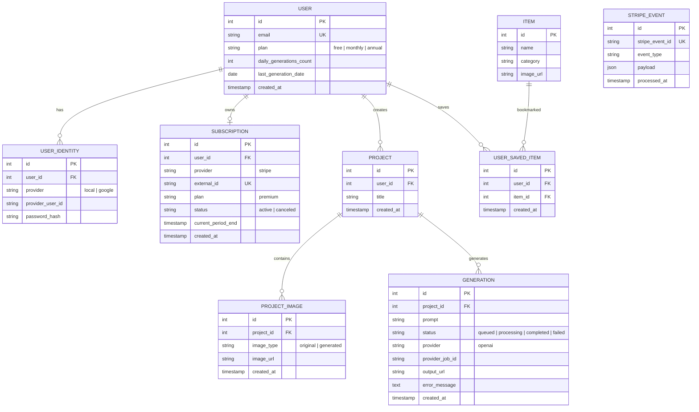
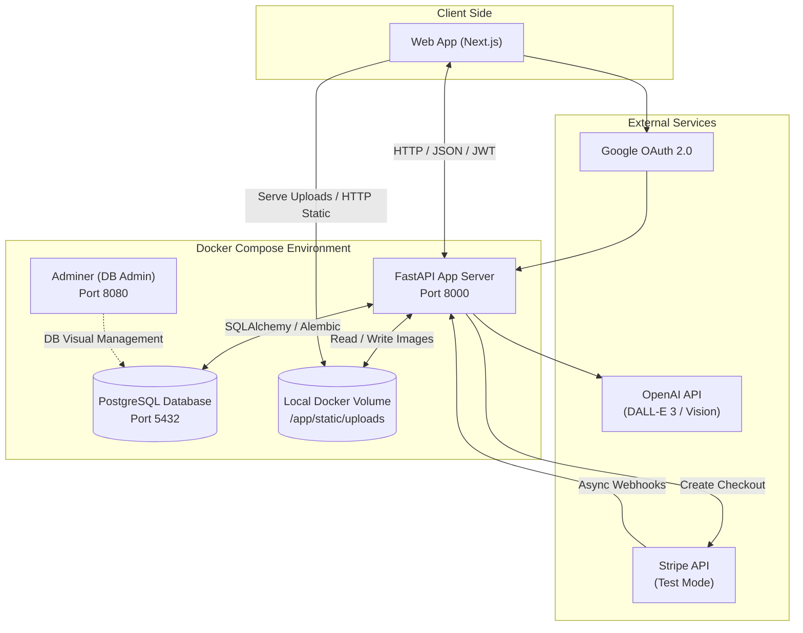
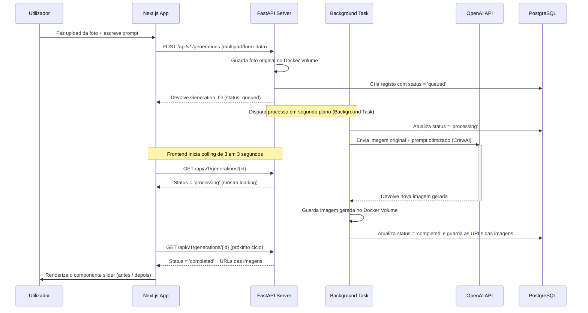

# Decozy Architecture & Documentation

Este ficheiro funciona como referência técnica do MVP da plataforma Decozy, desenvolvido para o projeto final de Web Programming da ETIC_Algarve.

## Conteúdo

1. [Visão geral](#visão-geral)
2. [Base de dados](#base-de-dados)
3. [Arquitetura do sistema](#arquitetura-do-sistema)
4. [Fluxo assíncrono de geração por IA](#fluxo-assíncrono-de-geração-por-ia)
5. [Core stack e deploy](#core-stack-e-deploy)
6. [Regras de negócio](#regras-de-negócio)

## Visão geral

A solução foi desenhada para equilibrar velocidade de desenvolvimento com uma base técnica sólida. O foco está em três áreas:

- geração assíncrona de imagens com IA;
- separação clara entre autenticação, projetos e subscrições;
- base preparada para evoluir de MVP local para uma arquitetura cloud.

## Base de dados

O modelo utiliza PostgreSQL e segue uma separação modular entre o utilizador, as credenciais de autenticação e os dados operacionais do produto.

## Arquitetura do sistema

O sistema é composto por um frontend Next.js, um backend FastAPI e serviços externos para autenticação, pagamentos e geração de imagens. Em ambiente local, tudo corre dentro de Docker Compose.

## Fluxo assíncrono de geração por IA

A geração de imagem pode demorar entre 20 e 30 segundos, por isso o processo não bloqueia a resposta da API. O backend cria o registo, dispara a task em segundo plano e o frontend faz polling até receber o resultado final.

## Core stack e deploy

A escolha dos componentes foi feita para manter o MVP simples de operar, mas com uma linha de evolução clara para produção.

- Frontend: Next.js (TypeScript)
  - MVP: App Router e Tailwind CSS
  - Produção: Vercel (plano Hobby)
- Backend: FastAPI (Python 3.12)
  - MVP: Orquestração da API e CrewAI
  - Produção: Render ou Railway
- Base de dados: PostgreSQL
  - MVP: container Docker oficial
  - Produção: Neon.tech ou Supabase
- ORM e migrations: SQLAlchemy e Alembic
  - MVP: gestão e versionamento local da base de dados
- Fila e workers: FastAPI BackgroundTasks
  - MVP: assíncrono nativo em memória do Python
  - Produção: Celery + Redis, caso o projeto escale
- Armazenamento: Docker Volumes
  - MVP: file system local dentro da pasta /static
  - Produção: Cloudflare R2 ou AWS S3
- Autenticação: Google OAuth + JWT
  - MVP: login social integrado à base de dados local
  - Produção: NextAuth ou Clerk
- Pagamentos: Stripe API
  - MVP: simulação em ambiente de testes
  - Produção: Stripe Live Mode

## Regras de negócio

### Quota diária

O utilizador com plano `free` tem limite de 1 geração por dia. A validação acontece no backend antes de a task ser enviada para a OpenAI, verificando `daily_generations_count` e `last_generation_date`.

### Idempotência de pagamentos

O endpoint de webhooks da Stripe regista o `stripe_event_id` na tabela `STRIPE_EVENT` antes de processar qualquer alteração de plano. Se o evento já existir, é ignorado para evitar duplicações de faturação ou créditos.

### Segurança de ficheiros

O upload de imagens valida o MIME type de forma estrita no backend, permitindo apenas `image/jpeg` e `image/png` para reduzir o risco de execução remota de scripts.
